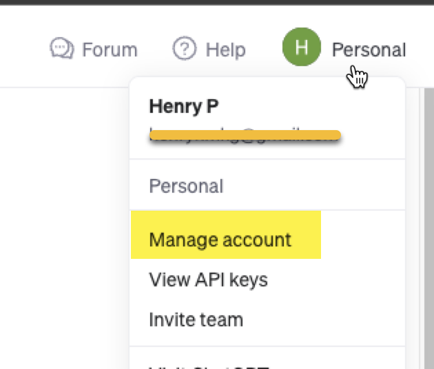

# openAI-mongodb-vectorsearch
Sample for project which is explain avout the use of mongodb with openAI and vector embedding.

## Step 1: Register for the API key on openAI.
- Link https://platform.openai.com/
- Go to this link and register for you self to ge the API key for getting embedding. ( Embedding is needed for the vector search)

